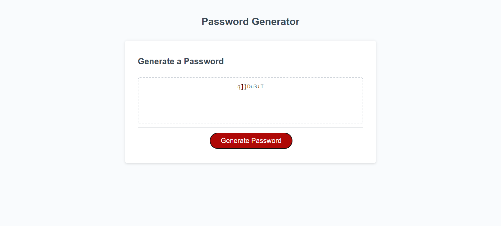
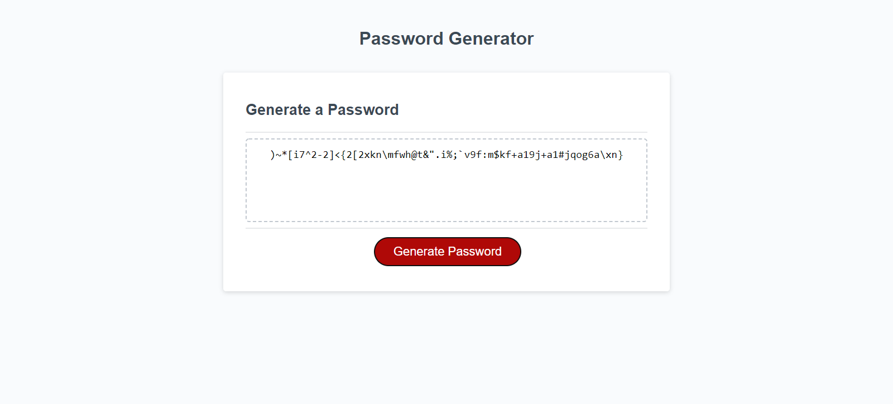
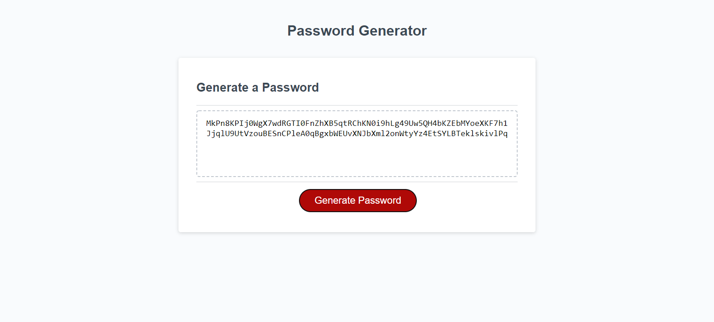

# Module 3 Challenge - Password Generator

## Table of contents

- [Overview](#overview)
  - [The challenge](#the-challenge)
  - [User Story](#user-story)
  - [Acceptance Criteria](#acceptance-criteria)
  - [Screenshot](#screenshot)
  - [Links](#links)
- [My process](#my-process)
  - [Built with](#built-with)
  - [What I learnt](#what-i-learnt)
 
## Overview

### The challenge

This week's Challenge requires you to create an application that an employee can use to generate a random password based on criteria they've selected. This app will run in the browser, and will feature dynamically updated HTML and CSS powered by JavaScript code that you write. It will have a clean and polished user interface that is responsive, ensuring that it adapts to multiple screen sizes. This week's coursework will teach you all the skills you need to succeed in this assignment.
The password can include special characters.

### User Story

```
AS AN employee with access to sensitive data
I WANT to randomly generate a password that meets certain criteria
SO THAT I can create a strong password that provides greater security
```

### Acceptance Criteria

```
GIVEN I need a new, secure password
WHEN I click the button to generate a password
THEN I am presented with a series of prompts for password criteria
WHEN prompted for password criteria
THEN I select which criteria to include in the password
WHEN prompted for the length of the password
THEN I choose a length of at least 8 characters and no more than 128 characters
WHEN asked for character types to include in the password
THEN I confirm whether or not to include lowercase, uppercase, numeric, and/or special characters
WHEN I answer each prompt
THEN my input should be validated and at least one character type should be selected
WHEN all prompts are answered
THEN a password is generated that matches the selected criteria
WHEN the password is generated
THEN the password is either displayed in an alert or written to the page
```

### Screenshot
**8 digit password with all combinations selected**


**60 digit password without uppercase letters**



**128 digit password without special characters**



### Links

- Github Repository URL: [Github Repository](https://github.com/rmdn321/3-Password-Generator)
- Github Pages URL: [Github Pages](https://rmdn321.github.io/3-Password-Generator/)

## My process

### Built with

- Semantic HTML5 markup
- CSS
- Javascript

### What I learnt

- Implement complex decision-making in your code using if and if-else statements.

- Explain the difference between equality and strict equality.

- Store related data in an array, and use array methods to mutate and perform operations on the array.

- Explain functions and how they are used in JavaScript.

- Explain the difference between function declarations and function expressions.

- Recognize whether a variable is locally or globally scoped, and explain the difference.

- Create objects and use object methods.

- Use the keyword var to declare a variable.


